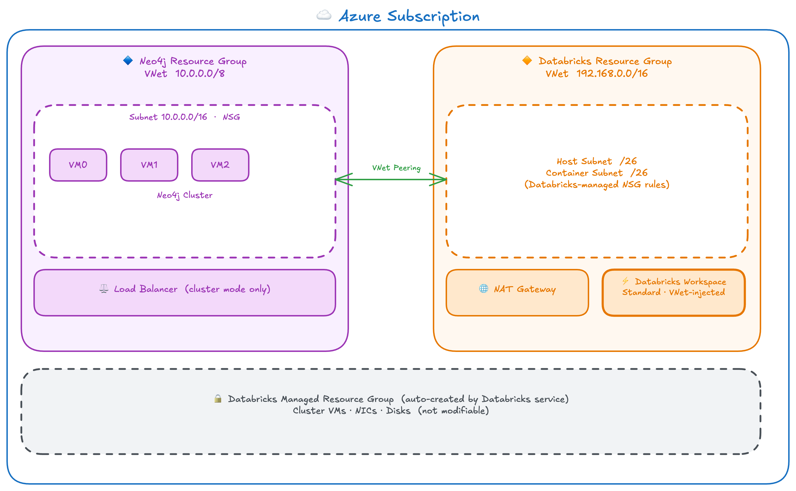

# Zero Public Internet: Connecting Databricks and Neo4j Entirely on the Azure Backbone

A Databricks notebook calls `driver.session().run("MATCH (n) RETURN n")`. The packet leaves the cluster node through the NAT gateway, crosses the public internet, arrives at a Neo4j VM's public IP, and the response takes the same route back. This is a common deployment pattern. Connections over this path are encrypted with TLS, which protects data in transit; a packet intercepted on the public internet is unreadable without the session keys.

Private network connectivity adds a layer on top of encryption. VNet peering routes traffic over the Microsoft backbone so it never reaches a public network; TLS encryption continues to protect the connection end to end across that private path. The two controls are independent: encryption protects against interception anywhere along the route, and network isolation removes the public route entirely. For organizations with compliance requirements that specify both controls, the combination is what makes this architecture worth the additional configuration.

This architecture builds both private routes. Bolt connections from VNet-injected Databricks job clusters traverse a direct VNet peering over the Microsoft backbone. Bolt connections from serverless compute — SQL warehouses, Mosaic AI agent endpoints, Lakeflow pipelines — travel through a Private Link tunnel on the same backbone. No packet leaves the Microsoft network regardless of which compute mode initiates the query.

---

## Graph Topology Reveals What Individual Records Do Not

Row-level data carries obvious sensitivity: account numbers, diagnosis codes, transaction amounts. Graph data carries a different kind. The relationship topology of a graph encodes meaning that individual records do not. A financial institution's graph knows which customers hold which products, which advisors manage which relationships, which entities share beneficial ownership. The topology is the regulated data, and network controls must apply to every query against it.

Financial services, healthcare, and government operate under data residency and network isolation requirements that make public internet transit a compliance failure regardless of whether the connection is encrypted. Private network connectivity is the requirement.

Serverless compute deserves particular attention here. SQL warehouses are the default compute behind Databricks SQL and interactive notebook queries. Mosaic AI agent deployments run on model serving endpoints, which execute on serverless infrastructure. Lakeflow Spark Declarative Pipelines run serverless. An organization that deploys Neo4j as a knowledge graph for AI agents and assumes job cluster connectivity is sufficient has left the most traffic-intensive path unprotected: agent queries during inference run on serverless, not on a VNet-injected job cluster.

---

## Acronyms

| Acronym | Full Term |
|---------|-----------|
| ARM | Azure Resource Manager |
| CIDR | Classless Inter-Domain Routing |
| ILB | Internal Load Balancer |
| NAT | Network Address Translation |
| NCC | Network Connectivity Configuration |
| NSG | Network Security Group |
| PLS | Private Link Service |
| SCC | Secure Cluster Connectivity |
| SKU | Stock Keeping Unit |
| TCP | Transmission Control Protocol |
| TLS | Transport Layer Security |
| UDR | User Defined Route |
| VNet | Virtual Network |
| VMSS | Virtual Machine Scale Set |

---

## Two Paths, One Endpoint

The architecture establishes two private routes from Databricks compute to a three-node Neo4j cluster. VNet-injected job clusters reach the cluster through a VNet peering connection. Serverless compute reaches the same cluster through a Private Link Service backed by the same load balancer frontend. Both paths terminate at a Standard internal load balancer that fronts the VMSS backend pool.

The two paths exist because job cluster VMs and serverless compute occupy fundamentally different network locations. Job cluster VMs land inside a customer-owned Azure Virtual Network, and a peering connection between that VNet and the Neo4j VNet creates a direct route. Serverless compute runs in Databricks-managed infrastructure in a Databricks-owned network with no customer-owned VNet on that side. A Private Link Service exposes the load balancer to private endpoint connections from outside the customer subscription. Both mechanisms are required for full coverage.

---

## VNet Injection Is a Day-Zero Decision

Standard Azure VNet peering connects two customer-owned Virtual Networks. A Databricks workspace deployed with default settings places its compute plane in a Microsoft-managed VNet that is not accessible for standard peering. VNet injection changes this by directing the workspace to place all cluster VMs into a customer-owned VNet, which makes standard peering possible.

VNet injection must be specified when the workspace is created. Azure provides no migration path from a non-injected workspace. An existing workspace cannot be updated; it must be deleted and recreated. The subnet CIDR blocks chosen at deployment time are equally fixed. If the Databricks VNet address space overlaps with the Neo4j VNet, peering fails, and the only resolution is to recreate both the VNet and workspace with a non-overlapping range.

VNet injection also requires that the customer-managed VNet be in the same Azure subscription and region as the workspace. Cross-subscription VNet injection is not supported.

A team that discovers this requirement after deploying a production workspace faces a recreation decision for that resource. The network configuration, including the VNet address space, subnet sizes, and workspace settings, must be correct before any clusters are created.

---

## The Peering Path

### Customer-Managed VNet and Subnet Delegation

The Databricks compute plane requires a customer-owned Virtual Network with two dedicated subnets. The host subnet receives driver nodes; the container subnet receives worker nodes. Both must be at least /26, and no other Azure resource may share either subnet. Azure enforces this through subnet delegation: once a subnet is delegated to `Microsoft.Databricks/workspaces`, only Databricks resources may land in it.

Delegation also transfers NSG rule management to the Databricks service, which adds and modifies rules automatically to maintain cluster communication. Azure requires that an NSG resource be attached to each subnet at workspace creation time, even though the workspace subsequently manages its own rules on those NSGs. Deploying without attached NSGs produces a `SubnetMissingNSG` error. The deployment attaches two empty NSGs and leaves rule management to the service.

### NAT Gateway

After March 31, 2026, new Azure VNets no longer provide default outbound internet access. Databricks cluster nodes must reach the Databricks control plane to receive job instructions, register heartbeats, and download libraries. A Standard SKU NAT gateway with a static public IP, attached to both subnets, provides that outbound path. The NAT gateway handles only outbound flows; inbound connections to cluster nodes from outside the VNet remain blocked.

### Workspace Configuration

The workspace resource points at the customer-managed VNet and names the host and container subnets. This directs Azure to place all cluster VMs into the customer-managed VNet rather than a Microsoft-managed one.

Secure Cluster Connectivity removes public IP addresses from cluster nodes entirely. All control-plane communication flows through a Databricks relay service over a tunnel that cluster nodes initiate outbound. The NAT gateway provides that outbound path. With no public IPs on cluster nodes and a NAT gateway handling outbound traffic, the cluster's network posture is correct for both private connectivity and control-plane access.

### Bidirectional VNet Peering

A single peering connection covers one direction. A peering from the Databricks VNet to the Neo4j VNet puts the Databricks VNet in the Initiated state, and traffic cannot flow until the reciprocal peering exists. Both connections must reach the Connected state before packets flow in either direction.

Because VNet injection places both VNets under customer control, the peering uses standard `Microsoft.Network/virtualNetworks/virtualNetworkPeerings` resources on each side. After both connections reach Connected, the Neo4j VNet's `VirtualNetwork` source tag in existing NSG rules automatically covers the peered Databricks address space. The cluster inter-node ports require no separate rule changes.

### NSG Update on the Neo4j Side

The original Neo4j NSG opens the Bolt port (7687), the browser ports (7473 and 7474), and the routing connector port (7688) to the Internet source tag, accepting connections from any public IP. After the peering is in place, those rules are replaced with rules scoped to the Databricks VNet CIDR (192.168.0.0/16).

A deny-all rule from 192.168.0.0/16 at priority 200 sits below the allow rules. Without it, the default `VirtualNetwork` allow rule at priority 65000 would permit a cluster node to reach any open port on the Neo4j VMs. The deny-all at priority 200 intercepts remaining traffic from the Databricks range before that default rule applies.

The packet's path from a job cluster to Neo4j is direct: container subnet, VNet peering, Neo4j NSG, internal load balancer, VMSS backend pool. The full round-trip stays on the Microsoft backbone.

---

## Serverless Compute Runs Outside the Customer Network

Classic Databricks job clusters execute on VMs placed inside the customer-owned VNet through VNet injection. The customer controls the network, the NSG rules, and the peering connections. Every packet from a job cluster carries a private IP address from within 192.168.0.0/16, and the peering gives that address a route to the Neo4j subnet.

Serverless compute operates on a different foundation. SQL warehouses, serverless jobs, Lakeflow Spark Declarative Pipelines, and Mosaic AI model serving endpoints all execute on Databricks-managed infrastructure in a Databricks-owned network isolated from the customer's Azure subscription. The customer has no visibility into that network, cannot attach NSGs to it, and cannot peer with it through standard Azure networking.

The workloads that run on serverless infrastructure cover the majority of interactive and production traffic in a Databricks deployment. SQL warehouses are the default compute behind Databricks SQL and interactive notebook queries; when a user opens a notebook and runs a query without starting a job cluster, that query executes on a SQL warehouse. Mosaic AI model serving endpoints are the runtime for AI agents and LLM-backed applications. A Mosaic AI agent that queries a Neo4j knowledge graph during inference runs on model serving infrastructure, which is serverless. Lakeflow pipelines default to serverless. Data quality monitoring and predictive optimization also run on serverless infrastructure.

An organization that deploys the VNet peering path and considers connectivity solved has covered job clusters. The SQL warehouse a data analyst uses to query the graph, the model serving endpoint an AI agent calls during inference, and the Lakeflow pipeline that loads entity relationships all execute outside the customer VNet. None of them can reach the Neo4j ILB through the peering because no route exists from Databricks-managed infrastructure to the customer VNet.

Private Link bridges this gap. A Private Link Service attached to the Neo4j ILB accepts private endpoint connections from outside the customer subscription, and a Network Connectivity Configuration provisions a private endpoint from Databricks-managed infrastructure to that service. The tunnel stays on the Microsoft backbone; the serverless compute node reaches Neo4j without a route to the customer VNet and without traffic leaving the Microsoft network.

---

## The Private Link Path

### Private Link Service

A Private Link Service wraps the Standard ILB frontend and exposes it for private endpoint connections from outside the customer VNet. When a private endpoint connects to the PLS, Azure builds a tunnel on the Azure backbone between the endpoint's network interface and the PLS. All traffic through that tunnel stays on the Microsoft network.

The PLS requires a dedicated subnet where `privateLinkServiceNetworkPolicies` is set to Disabled, which exempts Private Link traffic from NSG and UDR enforcement on that subnet. A /28 subnet in the Neo4j VNet (10.1.0.0/28) serves this purpose. Traffic arriving at the VMSS through the Private Link path carries the PLS NAT IP as its source address. That address falls within the Neo4j VNet, so the existing `VirtualNetwork` allow rule at priority 65000 covers it with no new NSG rules required.

### Network Connectivity Configuration

A Network Connectivity Configuration is an account-level Azure Databricks resource that defines the network policy for serverless compute in a given region. When a Private Endpoint Rule is added to an NCC targeting the PLS ARM resource ID, Databricks provisions a private endpoint from its managed infrastructure to the PLS. The connection appears on the PLS in Pending state and stays there until a customer identity with write access on the Neo4j resource group approves it. No traffic flows through the Private Link path until that approval is given. After approval, the NCC rule transitions to ESTABLISHED and serverless compute can use the path.

### The bolt:// Constraint for Serverless

Serverless connections through the Private Link path use `bolt://` rather than `neo4j://`. Routing mode sends an initial ROUTE request and the cluster responds with a routing table listing the private IPs of all three VMSS nodes. From serverless infrastructure, only the ILB frontend IP is reachable through the Private Link tunnel. The VMSS node IPs are not routable from that network, so the direct connections the driver opens to distribute reads and writes all fail.

`bolt://` targeted at the ILB frontend IP bypasses the routing table entirely. The driver sends all queries over a single connection to the ILB, which distributes them across the backend pool. The tradeoff is that the driver has no cluster topology awareness: it sends writes to whichever node the ILB selects, does not route reads to followers, and does not perform client-side failover.

VNet-injected job clusters use `neo4j://` and get full cluster-aware driver behavior. The peering makes the entire Neo4j VNet routable from the container subnet, so a job cluster fetches the routing table, receives the individual VMSS node IPs, and opens direct connections to each.

---

## The Security Boundary

The NSG on the Neo4j subnet is the sole access control gate between Databricks compute and the Neo4j cluster. The rule set determines exactly what is permitted.

Ports 7473, 7474, 7687, and 7688 accept inbound connections from 192.168.0.0/16. The AzureLoadBalancer source tag allows health probe traffic at priority 110. The deny-all from 192.168.0.0/16 at priority 200 blocks all other traffic from the Databricks range before the default VirtualNetwork allow rule at priority 65000 applies. SSH on port 22 accepts connections from the Internet source tag for administrative access. Cluster inter-node ports 6000 and 7000 accept connections from VirtualNetwork, which automatically covers the peered Databricks address space once both peering connections reach Connected.

The NSG evaluates packets at the subnet boundary; it has no effect on routing. VNet peering is what makes the CIDR-scoped rules reachable. Without it, a packet from a cluster node arrives at the NSG carrying the NAT gateway's public source IP, and the private-CIDR rules never match. The peering establishes the route; the NSG defines what is permitted across it.

---

## What the Combined Architecture Enables

With both paths live, the choice of compute mode has no effect on whether Neo4j traffic crosses the public internet.

A VNet-injected job cluster running a graph analytics notebook uses `neo4j://` pointed at the ILB, fetches the routing table, receives the private IPs of all three VMSS nodes, and distributes reads and writes directly across the cluster. A Mosaic AI agent serving endpoint uses `bolt://` pointed at the same ILB frontend, queries the knowledge graph through the Private Link tunnel, and returns results to the inference caller. A Lakeflow pipeline loads entity relationships into Neo4j over the Private Link path while a job cluster traverses the graph concurrently over the peering. All three reach the same VMSS backend pool. The ILB distributes the load. The NSG is the only control plane that matters.

The network boundary holds for every compute path. An organization deploying Mosaic AI agents against a Neo4j knowledge graph that holds regulated relationship data can run inference workloads through the model serving endpoint without that data leaving the Microsoft network. The peering alone does not cover that path. The Private Link path alone does not cover job cluster analytics. Together, they close the network boundary for the full range of Databricks compute.

---

## Deployment

Two implementation paths produce this architecture: Bicep templates under `infra/` and Ansible playbooks under `playbooks/`. Both produce identical resources with the same VNet CIDRs, subnet layout, NSG rule set, and workspace configuration.

Deployment runs in two phases. The first deploys the Neo4j cluster and Databricks workspace, including the Private Link Service and load balancer, via `uv run bicep-deploy deploy --scenario peer-databricks-v2025`. The second phase provisions the NCC, attaches it to the workspace, creates the Private Endpoint Rule, approves the PLS connection, and waits for the NCC rule to reach ESTABLISHED, via `uv run bicep-deploy setup-ncc --scenario peer-databricks-v2025`. The second phase is idempotent and can be re-run after a partial failure.
